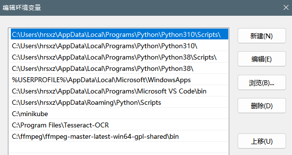
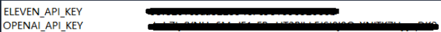
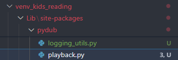

# kids_reading

An app that allows kids to scan the book's and read the book.

## Getting Started

### Prerequisites

#### Install FFmpeg for Eleven Labs' Play Audio Function

```python
from elevenlabs import generate, play

audio = generate(text, voice="DPsqCHWEBVTyO9962K8u")
play(audio)
```

#### Download ffmpeg (Window version)

  1. Download the appropriate version for Windows ([Go to the FFmpeg Download Page](https://github.com/BtbN/FFmpeg-Builds/releases)).

  2. Extract the files to a directory (e.g., C:\ffmpeg). And add ffmpeg to the System Path.

  3. Verify Installation:

      ```powershell
      ffmpeg --version
      ```

#### Add key in environment variables



#### Bugfix for pydub
  
  1. Open the file `pydub\utils.py` in the pydub package directory.
  
  2. Add line *" f.close()*  # close the file stream" in the _play_with_ffplay function.

      ```python
      def _play_with_ffplay(seg):
        PLAYER = get_player_name()
        with NamedTemporaryFile("w+b", suffix=".wav") as f:
            f.close()  # close the file stream
            seg.export(f.name, "wav")
            subprocess.call([PLAYER, "-nodisp", "-autoexit", "-hide_banner", f.name])
      ```
